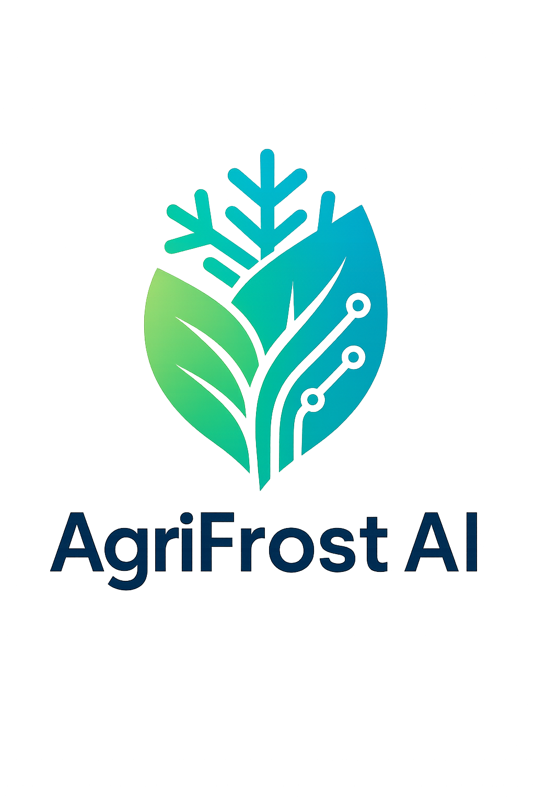

<div align="center">



# 🌡️ AgriFrost-AI

## F3 Innovate Frost Risk Forecasting Challenge (2025)

**AI-Powered Frost Risk Prediction System for California Agriculture**

</div>

---

**Author:** [Zhengkun LI](https://zhengkun-li.github.io/)  
**Email:** zhengkun.li3969@gmail.com  
**Affiliation:** TRIC Robotics / UF ABE / F3 Innovate Participant  
**Last Updated:** 2025-12-06  
**Report Location:** [docs/manuscript](https://github.com/Zhengkun-Li/AgriFrost-AI/tree/main/docs/manuscript)

## 📋 Project Description

AgriFrost-AI is an end-to-end machine learning system for frost risk forecasting in California's Central Valley agriculture. The system processes hourly meteorological observations from 18 CIMIS (California Irrigation Management Information System) stations spanning 2010-2025 (~2.37 million records) to predict frost events and temperature drops across multiple forecast horizons (3h, 6h, 12h, 24h).

### Key Features & Experimental Scale

- **ABC Feature Matrix Framework**: Systematic evaluation of spatial scope (single-station vs. multi-station) and feature complexity (raw vs. engineered features)
  - **3 Feature Matrices**: A (12 dim), B (278 dim), C (534 dim)
  - **4 Forecast Horizons**: 3h, 6h, 12h, 24h
  - **Spatial Radius Range**: 0-200 km (20 km step)
- **Comprehensive Model Comparison**: Systematic evaluation across 7 model families (LightGBM, XGBoost, CatBoost, Random Forest, GRU, LSTM, TCN) with reproducible experimental configurations
- **Best Performance**: Matrix B + LightGBM achieves PR-AUC 0.735 (3h) and 0.402 (24h), Matrix C achieves PR-AUC 0.718 (3h) and 0.474 (24h), with excellent spatial generalization (LOSO evaluation for A & B)
- **Production-Ready**: Complete pipeline from data processing to model deployment with strict temporal leakage protection and robust validation

### Supported Models

The system supports a wide range of machine learning and deep learning models organized by category:

**Machine Learning Models** (`src/models/ml/`):
- **Tree-based**: LightGBM, XGBoost, CatBoost, Random Forest, Extra Trees
- **Linear**: Linear Regression, Ridge, Lasso
- **Ensemble**: Voting, Stacking
- **Baseline**: Persistence (naive baseline)

**Deep Learning Models** (`src/models/deep/`):
- **Sequence Models**: LSTM, LSTM Multitask, GRU, TCN (Temporal Convolutional Network)

**Graph Neural Network Models** (`src/models/graph/`):
- **Spatial-Temporal**: DCRNN, ST-GCN, GAT-LSTM, GraphWaveNet
- *Note: Graph models require PyTorch Geometric and are optimized for multi-station spatial aggregation*

**Traditional Time Series Models** (`src/models/traditional/`):
- **Prophet**: Facebook Prophet (requires Date column)

> **📝 Note**: More models are under active development. See [src/models/README.md](src/models/README.md) for detailed model documentation and implementation details.

### Experimental Results Summary

#### Best Performance (Matrix C + LightGBM)

<div style="font-size:85%">

**Matrix C** represents multi-station spatial aggregation with raw features (534 dimensions). It combines single-station raw observations with spatial aggregation statistics (mean, gradient, range, etc.) from neighboring stations within a specified radius, capturing regional climate patterns such as cold air pooling and terrain effects. This configuration achieves the best balance between performance and feature complexity.

| Horizon | Radius | ROC-AUC ↑ | PR-AUC ↑ | Recall ↑ | Precision ↑ | Brier ↓ | ECE ↓ | MAE ↓ | RMSE ↓ | R² ↑ |
|---------|--------|-----------|----------|----------|-------------|---------|-------|-------|--------|------|
| 3h      | 60 km  | 0.997     | 0.718    | 0.933    | 0.342       | 0.008   | 0.010 | 1.19  | 1.58   | 0.968 |
| 6h      | 100 km | 0.994     | 0.583    | 0.932    | 0.202       | 0.016   | 0.021 | 1.65  | 2.16   | 0.941 |
| 12h     | 200 km | 0.988     | 0.492    | 0.919    | 0.127       | 0.027   | 0.036 | 1.91  | 2.49   | 0.921 |
| 24h     | 200 km | 0.988     | 0.474    | 0.908    | 0.118       | 0.027   | 0.039 | 1.86  | 2.43   | 0.925 |

</div>

#### Feature Selection Results (Matrix B, LightGBM, 12h Horizon)

- **90% Cumulative Importance**: 146 features (47.5% compression)
- **Performance**: ROC-AUC change < 0.01%, PR-AUC improvement +2.6%
- **Efficiency**: Training time reduced 35-40%, inference time reduced 30-35%

**Key Findings:**
- ✅ Excellent spatial generalization (LOSO ROC-AUC > 0.98 for all horizons, no performance degradation)
- ✅ Outstanding probability calibration (Brier Score < 0.005, ECE < 0.004)
- ✅ High-precision temperature prediction (MAE < 2°C, RMSE < 2.5°C)
- ✅ Effective feature selection (146 features maintain performance with 47.5% compression)

#### Complete Results Data

Complete experimental results are available in the Supplementary Materials:

- **[All Experiments](docs/manuscript/Supplementary/supplementary_table_S2_all_experiments.csv)**: Complete performance metrics for all experimental configurations
- **[Best Configurations](docs/manuscript/Supplementary/supplementary_table_S3_best_configurations.csv)**: Optimal configurations for each feature matrix and horizon
- **[Matrix Summary](docs/manuscript/Supplementary/supplementary_table_S4_matrix_summary.csv)**: Statistical summary aggregated by matrix and horizon
- **[Feature Importance](docs/manuscript/Supplementary/supplementary_table_S5_feature_category_importance.csv)**: Cumulative importance of feature categories across horizons
- **[Top Features](docs/manuscript/Supplementary/supplementary_table_S6_top_features_by_category.csv)**: Importance of top features in each category

See [Supplementary Materials](docs/manuscript/Supplementary/) for complete documentation of all supplementary tables.

**📦 Complete Experimental Results (OneDrive)**: All experimental results, including model weights, training logs, detailed metrics, and experiment outputs, have been uploaded to a OneDrive folder: [https://uflorida-my.sharepoint.com/:f:/r/personal/zhengkun_li_ufl_edu/Documents/frost-risk-forecast-challenge-2025?csf=1&web=1&e=bXLvog](https://uflorida-my.sharepoint.com/:f:/r/personal/zhengkun_li_ufl_edu/Documents/frost-risk-forecast-challenge-2025?csf=1&web=1&e=bXLvog)

## 🚀 Quick Start

### ⭐ New Unified CLI (Recommended)

#### Step 1: Set Up Virtual Environment

```bash
# Create virtual environment (if not already created)
python3 -m venv .venv

# Activate virtual environment
# Linux/macOS:
source .venv/bin/activate
# Windows:
# .venv\Scripts\activate.bat  (Command Prompt)
# .venv\Scripts\Activate.ps1   (PowerShell)

# Install dependencies
pip install --upgrade pip
pip install -r requirements.txt
```

> **✅ Good News**: By default, `requirements.txt` does **NOT** include PyTorch/CUDA. You can install dependencies immediately without downloading ~2GB of PyTorch packages. PyTorch is only needed if you plan to use deep learning models (GRU, LSTM, TCN).

**Verify activation**: Command prompt should show `(.venv)` prefix

#### Step 2: Download Data

**Important**: This repository contains only code. Data files must be downloaded separately.

```bash
# Clone the data repository
git clone https://github.com/CarlSaganPhD/frost-risk-forecast-challenge.git data_repo

# Copy data to project directory
mkdir -p data/raw/frost-risk-forecast-challenge
cp -r data_repo/stations data/raw/frost-risk-forecast-challenge/
cp data_repo/cimis_all_stations.csv.gz data/raw/frost-risk-forecast-challenge/

# Or download manually from:
# https://github.com/CarlSaganPhD/frost-risk-forecast-challenge
```

The data includes:
- **18 CIMIS station files** (2010–2025, hourly observations)
- **Combined CSV** (`cimis_all_stations.csv.gz`, ~2.37M rows (2,367,360), 38 MB gzipped)

#### Step 3: Run Commands

> **⭐ Recommended**: Use the unified CLI (`python -m src.cli ...`) for training, evaluation, inference, and analysis.  
> **📖 CLI Documentation**: See [scripts/README.md](scripts/README.md) for complete CLI usage guide with all commands and detailed examples.  
> **Note**: The `scripts/` directory contains additional tool scripts (e.g., `scripts/tools/fetch_station_metadata.py`) that can be used as needed.

**General CLI Command Structure:**

```bash
# Training
python -m src.cli train single \
    --model-name <lightgbm|xgboost|catboost|random_forest|gru|lstm|tcn> \
    --matrix-cell <A|B|C|D|E> \
    --track <raw|feature_engineering|top175_features|...> \
    --horizon-h <3|6|12|24> \
    [--radius-km <float>] \          # For Matrix C/D (spatial aggregation)
    [--knn-k <int>] \                # For Matrix E (KNN)
    [--sample-size <int>] \          # Limit data size for quick testing
    [--output-dir <path>] \          # Custom output directory
    [--config <yaml_file>]           # YAML config file

# Evaluation
python -m src.cli evaluate model \
    --model-dir <path> \
    [--config <yaml_file>] \
    [--output-dir <path>]

python -m src.cli evaluate compare \
    --model-dirs <dir1> <dir2> [<dir3>...] \
    [--output-dir <path>]

python -m src.cli evaluate matrix \
    --experiments-dir <path> \
    [--output-dir <path>]

# Inference
python -m src.cli inference predict \
    --model-dir <path> \
    --input <csv_file> \
    --output <csv_file> \
    [--horizon-h <3|6|12|24> [--horizon-h <...>]]  # Can specify multiple

# Analysis
python -m src.cli analysis full \
    --data-path <csv_file> \
    --model-dir <path> \
    [--output-dir <path>]

# Get help for any command
python -m src.cli --help
python -m src.cli train --help
python -m src.cli evaluate --help
python -m src.cli inference --help
python -m src.cli analysis --help
```

**Key Parameters:**
- **Model names**: 
  - *Machine Learning*: `lightgbm`, `xgboost`, `catboost`, `random_forest`, `extratrees`, `linear`, `ensemble`, `persistence`
  - *Deep Learning*: `gru`, `lstm`, `lstm_multitask`, `tcn`
  - *Graph Neural Networks*: `dcrnn`, `st_gcn`, `gat_lstm`, `graphwavenet`
  - *Traditional*: `prophet`
  - *Note: More models are under development. See [Supported Models](#supported-models) section above.*
- **Matrix cells**: `A` (16 dim, single-station + raw), `B` (278 dim, single-station + engineered), `C` (534 dim, multi-station + raw), `D` (818 dim, multi-station + engineered), `E` (KNN-based)
- **Tracks**: `raw`, `feature_engineering`, `top175_features`, etc.
- **Horizons**: `3`, `6`, `12`, `24` (hours)
- **Radius** (for C/D): `0-200` km (typically: 60, 160, 180, 200 km)

**Quick Test (Recommended for first-time users):**

Start with the simplest configuration (Matrix A + LightGBM + 3h) for quick testing:

```bash
# Step 1: Train with Matrix A (16 raw features, fastest to train)
python -m src.cli train single \
    --model-name lightgbm \
    --matrix-cell A \
    --horizon-h 3 \
    --sample-size 100000 \
    --output-dir experiments/lightgbm_A_3h_test

# Step 2: Generate predictions with trained model
python -m src.cli inference predict \
    --model-dir experiments/lightgbm_A_3h_test \
    --input data/processed/labeled_data.parquet \
    --output predictions_test.csv \
    --horizon-h 3
```

Once you're comfortable with the basic workflow, you can proceed to more complex configurations:

```bash
# Next: Try Matrix B (278 engineered features) for better performance
python -m src.cli train single \
    --model-name lightgbm \
    --matrix-cell B \
    --track top175_features \
    --horizon-h 12 \
    --sample-size 100000 \
    --output-dir experiments/lightgbm_B_12h_test

# Or try Matrix C (534 spatial aggregation features) for best performance
python -m src.cli train single \
    --model-name lightgbm \
    --matrix-cell C \
    --horizon-h 3 \
    --sample-size 100000 \
    --output-dir experiments/lightgbm_C_3h_test
```

**Full Training (Production):**
```bash
# Train with full dataset
python -m src.cli train single \
    --model-name lightgbm \
    --matrix-cell B \
    --track top175_features \
    --horizon-h 12 \
    --output-dir experiments/lightgbm_B_12h

# Run matrix experiments (batch training) - Using CLI
python -m src.cli train matrix \
    --config config/pipeline/matrix_experiments.yaml

# Batch train multiple models (using script) - Alternative method
# Train all models (xgboost, catboost, random_forest) on all matrix cells
bash scripts/experiments/start_batch_training.sh

# Or customize which models to train
python scripts/experiments/batch_train_all_models.py \
    --models xgboost catboost \
    --matrix-cells A B C D \
    --skip-existing

# Evaluate single model
python -m src.cli evaluate model \
    --model-dir experiments/lightgbm_B_12h \
    --config config/evaluation.yaml

# Compare multiple models
python -m src.cli evaluate compare \
    --model-dirs experiments/model1 experiments/model2 \
    --output-dir comparison/

# Generate matrix summary
python -m src.cli evaluate matrix \
    --experiments-dir experiments/ \
    --output-dir matrix_summary/

# Generate predictions
python -m src.cli inference predict \
    --model-dir experiments/lightgbm_B_12h_test \
    --input data/test.csv \
    --output predictions.csv \
    --horizon-h 12

# Feature analysis
python -m src.cli analysis full \
    --data-path data/train.csv \
    --model-dir experiments/lightgbm_B_12h \
    --output-dir analysis/features

# Generate feature importance figures for manuscript
# Generate Matrix A feature importance figure (Figure 12)
python scripts/tools/generate_matrix_a_feature_importance.py

# Generate Matrix A supplementary table (Table S7)
python scripts/tools/generate_matrix_a_supplementary_table.py

# Generate feature category importance bar chart (Figure 13)
python scripts/tools/generate_feature_category_importance_bar.py
```


## 📚 Documentation

### Quick Links

- **🚀 [Quick Start Guide](docs/guides/QUICK_START.md)**: Get started in 15 minutes! (Recommended for new users)
- **📖 [User Guide](docs/guides/USER_GUIDE.md)**: Complete usage instructions
- **🏗️ [Implementation Guide](docs/guides/IMPLEMENTATION_GUIDE.md)**: System architecture and methodology
- **🤖 [Models Guide](docs/models/MODELS_GUIDE.md)**: Detailed model descriptions
- **📊 [Feature Guide](docs/features/FEATURE_GUIDE.md)**: Feature engineering guide
- **🔬 [Technical Documentation](docs/technical/TECHNICAL_DOCUMENTATION.md)**: Technical details

### CLI Documentation

- **[Unified CLI Guide](scripts/README.md)**: Complete CLI documentation with all commands, detailed usage examples, and help information
  - **Main operations** (training, evaluation, inference, analysis): Use `python -m src.cli ...`
  - **Batch training scripts**: For training multiple models, see `scripts/experiments/`:
    - `batch_train_all_models.py` - Batch train multiple ML models (lightgbm, xgboost, catboost, random_forest)
    - `batch_train_deep_models.py` - Batch train deep learning models (GRU, LSTM, TCN)
    - `start_batch_training.sh` - Quick start script for batch training
  - **Tool scripts**: Additional utilities in `scripts/tools/` (e.g., `fetch_station_metadata.py`, `generate_station_map.py`)

## 📦 Example Experiment

A complete example experiment output is available to demonstrate the structure and content of experiment results:

- **[Example Experiment: LightGBM Matrix A](experiments/lightgbm/raw/A/full_training_example/)**: Complete baseline experiment with LightGBM on Matrix A (12 MB, 200 files)
  - Includes trained models, metrics, feature importance, reliability diagrams, and LOSO evaluation
  - Demonstrates the standard output format for all experiments
  - Large data files excluded to keep repository size manageable

This example helps users understand the experiment structure before running their own training pipelines.

## 🧾 Project Structure

```
frost-risk-forecast-challenge/
├── data/                    # Data directory (not in repo, download from GitHub)
│   └── raw/
│       └── frost-risk-forecast-challenge/
│           ├── stations/    # 18 CIMIS station CSV files (download required)
│           └── cimis_all_stations.csv.gz  # Combined data (download required)
│   └── (interim/, processed/, external/ created during processing)
├── src/                     # Source code (library code)
│   ├── data/                # Data processing pipeline
│   │   ├── loaders.py       # Data loading (CSV, Parquet, directories)
│   │   ├── cleaners.py      # Data cleaning (QC, outliers, imputation)
│   │   ├── features/        # Feature engineering modules
│   │   │   ├── temporal.py  # Time-based features
│   │   │   ├── lagging.py   # Lag and rolling window features
│   │   │   ├── derived.py   # Derived meteorological features
│   │   │   ├── station.py   # Station-level features
│   │   │   └── constants.py # Column name constants
│   │   ├── spatial/         # Spatial aggregation (C/D tracks)
│   │   ├── frost_labels.py  # Frost label generation
│   │   ├── preprocessors.py # Scaling, imputation
│   │   ├── feature_selection.py # Feature selection
│   │   └── pipeline.py      # Unified DataPipeline
│   ├── training/            # Training modules
│   │   ├── pipeline_runner.py # Training/Evaluation/Inference runners
│   │   ├── model_trainer.py   # Model training logic
│   │   ├── data_preparation.py # Data preparation utilities
│   │   └── loso_evaluator.py  # LOSO evaluation
│   ├── models/              # Model implementations
│   │   ├── base.py          # Base model interface
│   │   ├── registry.py      # Model registry
│   │   ├── ml/              # Machine learning models (LightGBM, XGBoost, etc.)
│   │   ├── deep/            # Deep learning models (LSTM, GRU, TCN)
│   │   └── graph/           # Graph neural networks (DCRNN, etc.)
│   ├── evaluation/          # Evaluation modules
│   │   ├── metrics.py       # Evaluation metrics (MAE, RMSE, ROC-AUC, ECE, etc.)
│   │   ├── validators.py    # Cross-validation strategies (time_split, LOSO, etc.)
│   │   ├── registry.py      # Evaluation strategy registry
│   │   ├── multi_horizon_evaluator.py  # Multi-horizon evaluation
│   │   ├── matrix_evaluator.py         # 2×2+1 matrix evaluation
│   │   └── spatial_sensitivity_evaluator.py  # Spatial parameter sensitivity
│   ├── cli/                 # ⭐ Unified CLI (Recommended)
│   │   ├── main.py          # CLI entry point
│   │   ├── common.py        # Common utilities
│   │   └── commands/        # CLI commands
│   │       ├── train.py      # Training commands
│   │       ├── evaluate.py   # Evaluation commands
│   │       ├── inference.py  # Inference commands
│   │       └── analysis.py   # Analysis commands
│   ├── visualization/       # Visualization utilities
│   │   └── plots.py         # Plotting functions (matplotlib, plotly)
│   └── utils/               # Utility functions
│       ├── calibration.py   # Probability calibration
│       ├── hyperopt.py       # Hyperparameter optimization
│       ├── losses.py         # Custom loss functions
│       └── path_utils.py    # Path utilities
├── scripts/                 # Scripts and tools
│   ├── README.md            # CLI usage guide
│   ├── MIGRATION.md         # Migration guide (from old scripts)
│   ├── tools/               # Independent tool scripts
│   └── test/                # Test scripts
├── config/                  # Configuration files
│   ├── data_cleaning*.yaml  # Data cleaning configurations
│   ├── feature_engineering/ # Feature engineering configs
│   └── pipeline/            # Pipeline configurations
├── experiments/             # Experiment results (created during training, not tracked in repo)
├── results/                 # Result summaries (not tracked in repo)
├── docs/                    # Documentation
│   ├── guides/              # User guides and tutorials
│   ├── technical/           # Technical documentation
│   ├── features/            # Feature engineering guides
│   ├── models/              # Model guides
│   ├── training/            # Training guides
│   ├── inference/           # Inference guides
│   └── manuscript/          # Academic manuscript
├── tests/                   # Test code
│   ├── data/                # Data module tests
│   ├── models/              # Model tests
│   └── evaluation/          # Evaluation tests
└── README.md                # This file
```

## 🔗 Links

- **Data Repository**: https://github.com/CarlSaganPhD/frost-risk-forecast-challenge
- **Manuscript**: [docs/manuscript/frost-risk-forecast challenge report.pdf](docs/manuscript/frost-risk-forecast%20challenge%20report.pdf)
- **Supplementary Materials**: [docs/manuscript/Supplementary/](docs/manuscript/Supplementary/)
- **Experiment Results**: Results are stored in `results/` directory (not tracked in repo). Run `python scripts/tools/update_results.py` to generate summaries.

## 📄 License

This project is licensed under the [Creative Commons Attribution-NonCommercial 4.0 International License](https://creativecommons.org/licenses/by-nc/4.0/) (CC BY-NC 4.0).

See the [LICENSE](LICENSE) file for the full legal text.

## 📖 Citation

If you use this project in your research, please cite it as follows:

```bibtex
@software{agrifrost_ai_2025,
  author = {Li, Zhengkun},
  title = {AgriFrost-AI: Frost Risk Forecasting Methods and Evaluation for California's Central Valley},
  year = {2025},
  url = {https://github.com/Zhengkun-Li/AgriFrost-AI},
  note = {F3 Innovate Frost Risk Forecasting Challenge},
  license = {CC-BY-NC-4.0}
}
```

